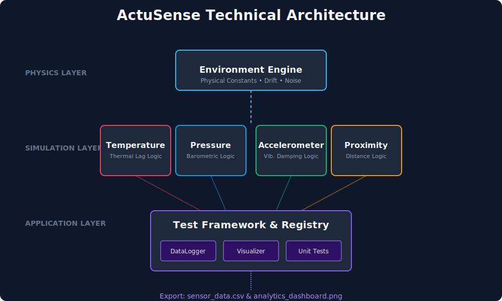
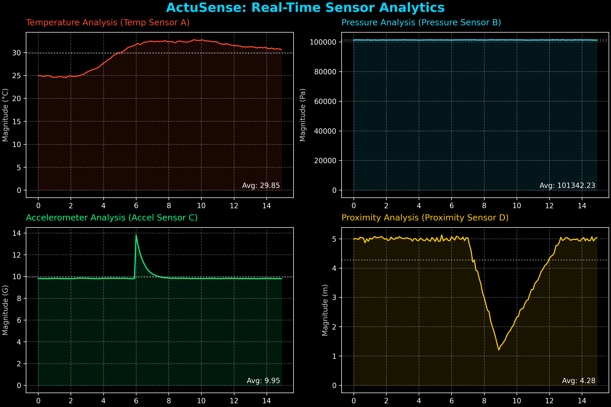

# ActuSense: Industrial Sensor Simulation Framework

ActuSense is a high-fidelity C++17 framework designed for the simulation, testing, and validation of multi-modal sensor networks. It decouples physical law modeling from sensor behavior, enabling engineers to stress-test data acquisition systems against complex environmental scenarios.

---

## System Architecture

The project follows a layered architectural pattern to ensure strict separation of concerns and high extensibility.



1.  **Physics Layer**: The `Environment` engine simulates ground-truth physical states (thermal drift, pressure gradients, mechanical impulses).
2.  **Simulation Layer**: Concrete sensor implementations model real-world response characteristics, including thermal mass inertia and signal noise.
3.  **Application Layer**: A centralized `Registry` and `TestFramework` handle sensor orchestration, data logging, and real-time visualization.

---

## Analytics & Performance Validation

The framework provides an automated analytics pipeline. Below is the output from a **15-second simulation run** showcasing the fidelity of our behavioral modeling.



### Behavioral Deep Dive:
*   **Temperature (Top Left)**: Demonstrates **Thermal Lag Logic**. At $t=2s$, a heat event is triggered. The sensor reading follows a first-order differential response rather than an instantaneous change, mimicking real-world thermal mass.
*   **Accelerometer (Bottom Left)**: Features **Dynamic Mechanical Shocks**. After a primary impulse at $t=6s$, the system models exponential vibration decay as energy dissipates through the simulated mounting structure.
*   **Proximity (Bottom Right)**: Monitors **Object Intrusion**. High-frequency noise is injected at $t=8s$ to test the robustness of detection algorithms against signal jitter.

---

## Engineering Stack

- **Language**: C++17 (Clang/GCC/MSVC)
- **Visuals**: SFML 2.5 (Live Dashboard), Python (Offline Analytics)
- **Testing**: GoogleTest (Unit & Integration)
- **Deployment**: Multi-stage Docker optimization

## Getting Started

### Quick Start (Native)
```bash
cmake -S . -B build -DENABLE_VISUALIZATION=ON
cmake --build build --config Release
./build/apps/ActuSenseApp
```

### Quick Start (Docker)
```bash
docker build -t actusense .
docker run -it actusense
```

---

## Controls (GUI Mode)

- **`[H]`**: Trigger Active Heat Wave (Simulates environment temperature rise)
- **`[S]`**: Trigger Mechanical Shock (Simulates high-G impact)
- **`[C]`**: Initiate Calibration Sequence (Calculates sensor offsets)
- **`[ESC]`**: Graceful Shutdown

---

## License

Distributed under the MIT License. See `LICENSE` for more information.
